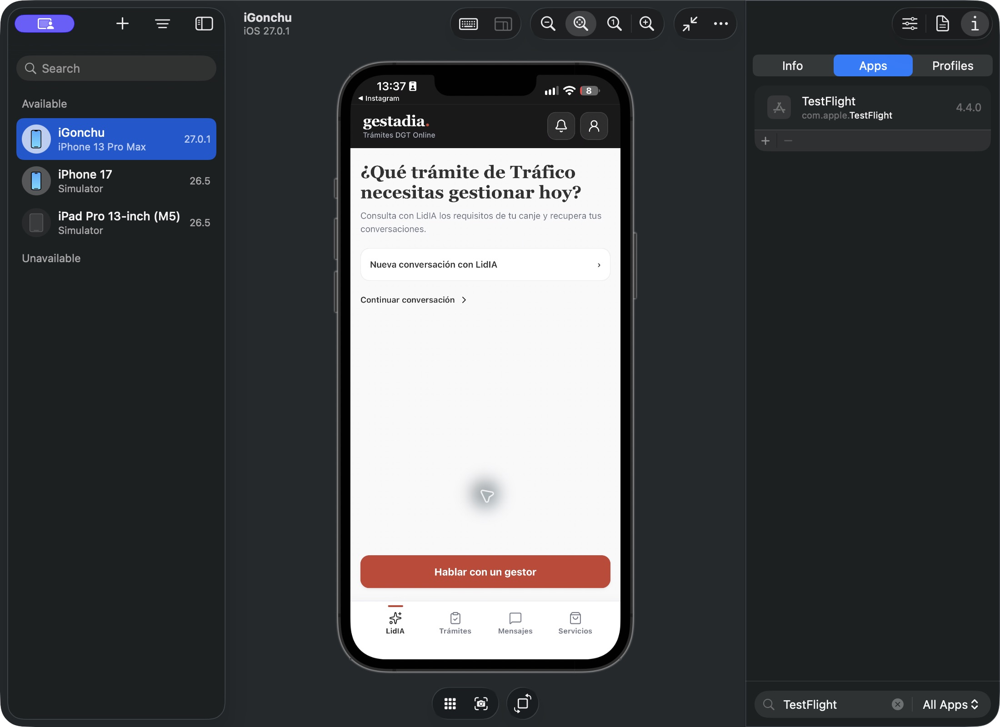

# Instalación de la APP en el iPhone de Gonzalo — 08/10/2026

[Glosario](../../GLOSARIO.md) · [Última corrección de conversaciones](2026-10-08-nueva-conversacion-lidia.md)

El usuario solicita instalar primero la última revisión y después implementar los recibos de mensajes coordinados con LidIA.

## Instalación comprobada

- Dispositivo físico «iGonchu», iPhone 13 Pro Max, iOS 27.0.1, conectado por cable y con modo desarrollador activo.
- Código `fbd9ae0dfb3b8a4d549b93a13d0d93e199293ca9`, APP `com.gestadia.app`, versión 0.1.0, build **8**.
- `xcodebuild` para el dispositivo: **BUILD SUCCEEDED**, firma automática del equipo previamente autorizado Defensa Legal Consumidores (`X27NG7M487`).
- `codesign --verify --deep --strict` correcto. `devicectl` confirma instalación y apertura. Una consulta posterior de aplicaciones confirma `bundleVersion: 8`.
- Device Hub muestra el dispositivo físico y la APP abierta en Inicio, con «Nueva conversación con LidIA», «Continuar conversación» y las cuatro pestañas.

[Versión, revisión y hash de assets](evidencias/2026-10-08-iphone-gonzalo/instalacion.json).

## Conexión y límites

La interfaz está empaquetada en la aplicación; no se publica en TestFlight ni App Store. La instalación conserva los datos existentes.

La configuración pública empaquetada proponía el backend local del Mac, pero la carga nativa conserva el origen HTTPS predeterminado `https://app.gestadia.com`; este build no acredita una conexión al backend local. No se compiló un origen nativo de desarrollo explícito. El proxy temporal HTTP fue rechazado por la revisión automática por exponer endpoints autenticados y posibles datos sensibles en la LAN sin autorización explícita. Se solicita autorización al usuario para tres horas de pruebas con cuenta ficticia; **no se ha abierto el puerto ni validado acceso/conversación en el teléfono físico**. La ausencia de respuesta no autoriza la conexión.

La excepción ATS local existente se conserva; el motivo de acceso a red local se incorpora sólo al paquete físico de desarrollo, según [la documentación de Apple](https://developer.apple.com/documentation/technotes/tn3179-understanding-local-network-privacy). Los archivos del proyecto y la configuración del simulador se restauran después de compilar. No se cambian claves, grants, agente ni canal.

Los ticks de recibido/leído solicitados son el siguiente bloque; el build 8 aún no los incluye. La autoridad durable será LidIA, con contrato escrito acordado por ambos equipos antes de implementar.

## Actualización posterior: build10 con recibos

El bloque d887caa añade los ticks y el consumidor de recibos. Después de pasar backend167/167 y frontend144/144, el build10 se compiló/firma verificó e instaló en el mismo iGonchu. devicectl confirma la apertura y una consulta independiente de apps confirma build10, versión0.1.0. [Hash y resultado de la instalación](evidencias/2026-10-08-iphone-gonzalo/instalacion-build10.json).

Este paquete conserva el origen nativo HTTPS app.gestadia.com; no contiene el fixture visual ni el proxy LAN. La interfaz/entrada de texto/ticks se comprobó en simulador build9 con fixture loopback, no contra el backend conectado. No se acredita funcionalidad del backend en el iPhone físico: permiso LAN pendiente y proveedor LidIA preparando su runtime aislado. Device Hub no permite capturar la pantalla física del build10 porque indica micrófono/cámara activos; no se cambian los usos del teléfono para forzarlo. La captura de Inicio anterior corresponde al build8.
