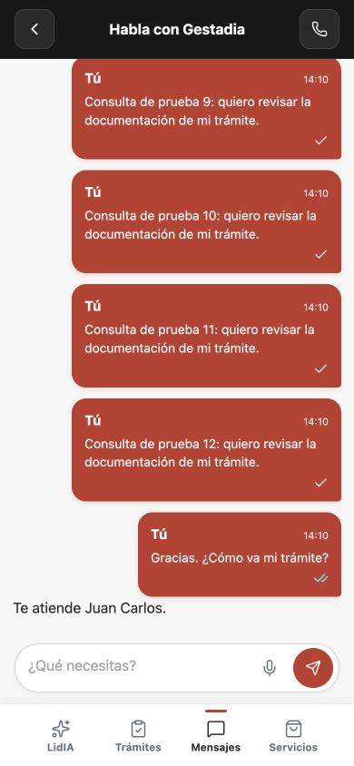
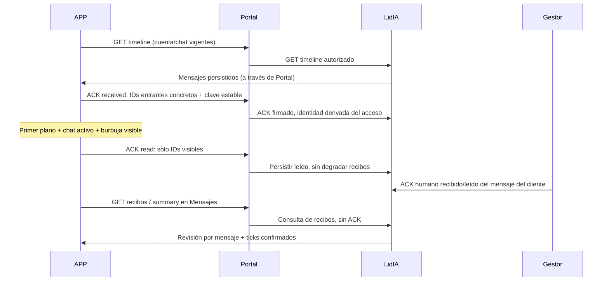

# Plan APP: recibido y leído — 08/10/2026

[Glosario](../../GLOSARIO.md) · [Contrato acordado](../integraciones/2026-10-08-app-recibos-mensajes.md) · [Instalación física previa](2026-10-08-iphone-gonzalo.md)

Rama aislada codex/app-recibos-mensajes, basada en fbd9ae0. Autorización del usuario: instalar primero la última APP y después implementar los ticks coordinados con LidIA. El iPhone ya tiene build 8; todavía no contiene este bloque.

1. **Hecho:** instalación firmada y arranque en iGonchu. Acceso LAN pendiente de respuesta explícita; no se abre el proxy rechazado.
2. **Hecho:** conformidad escrita de ambos equipos: endpoints separados, recibos durables por mensaje, ACK recibido/leído por IDs concretos y permisos existentes. No modificar timeline 1.0, grants, agentes ni canales.
3. **Hecho:** TDD del proxy Portal: pertenencia, caso/contexto vigente, validación estricta, traducción de IDs, respuesta durable/reintentos y rechazo de acuses de los propios mensajes.
4. **Hecho:** chat: tick accesible, mezcla por revisión de mensaje, ACK recibido tras aceptación del mensaje en estado cliente y leído sólo con burbuja visible, conversación activa y APP visible. Salir/cambiar cuenta invalida respuestas antiguas. Mensajes consulta resumen y no confirma lectura.
5. **Pendiente:** pruebas completas y ejecución real web/iOS del ciclo enviado→recibido→leído con operador; repetir instalación física con el nuevo build cuando el bloque esté validado. Android: build y comprobación separada; no atribuir aceptación de interfaz sin ejecución.

Pruebas necesarias: lectura con historial parcial sin watermark, APP oculta, listado sin lectura, recepción sin visibilidad, ACK duplicado/perdido, cambio de chat/cuenta, revisiones fuera de orden, permisos/revocación/caso, conversación cerrada y mensajes históricos sin acuses inventados.

## Verificación Portal y APP

- Backend completo: **167/167**; interfaz completa: **144/144**, incluyendo 9 pruebas específicas de visibilidad/ACK. Las 26 muestras válidas/inválidas de LidIA se validan con el mismo esquema estricto, sin modificar DTO de timeline1.0.
- Regresiones reproducidas y corregidas: lectura que retrocedía al añadir mensajes, y getState nativo atrasado que reactivaba la APP tras un evento de segundo plano. Reintento ACK conserva cuerpo/clave; chat anterior/oculto, lectura IA, listado y burbuja no visible no acreditan leído.
- Build web correcto. **Simulador iPhone17/iOS26.5, build9**: instalación, apertura, acceso con cuenta ficticia por Device Hub, Mensajes compacto con tick, y chat con doble tick azul comprobados. Capture Keyboard activo y texto del teclado comprobado en el input.
- Fixture visual aislado en loopback 5180/3005, sin conexión al agente ni BBDD de LidIA: Mensajes no emite ACK; burbuja superior fuera de pantalla queda recibida/sin leído; al hacer scroll pasa a read_by=account. Sent→received→read desde control de operador ficticio se refleja en la UI. **No prueba el ciclo conectado de gestor ni producción.**
- Contraste de iconos: azul sobre rojo Gestadia **3,55:1**, sobre burbuja LidIA **7,65:1**, azul sobre blanco **4,71:1**. Estado accesible por nombre, independiente del color.
- Pendiente: runtime nuevo LidIA y E2E conjunto, última reinstalación física y acceso local (permiso LAN aún pendiente).

[Mensajes recibido, fixture web](evidencias/2026-10-08-recibos/web-mensajes-recibido.png) · [Mensajes leído, simulador iOS](evidencias/2026-10-08-recibos/ios-mensajes-leido.png)

