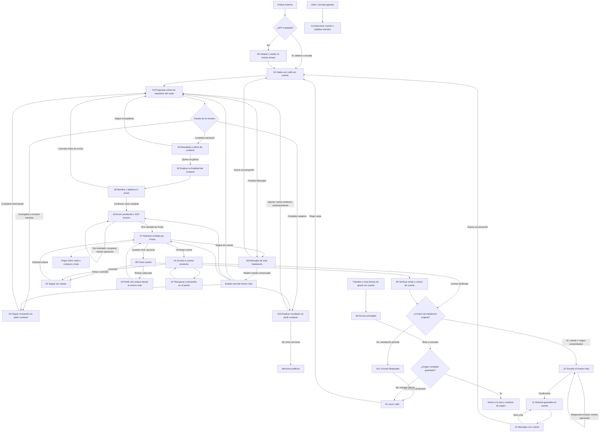

# Revisión visual: pantallas y flujo APP sin cuenta

**10/10/2026 · Propuesta pendiente de aprobación humana.** Sólo APP. Sin implementación, activación ni despliegue. [Glosario](../../GLOSARIO.md) · [Propuesta técnica](../integraciones/2026-10-10-propuesta-app-anonima-lidia.md) · [Contraste con LidIA](../integraciones/2026-10-10-contraste-portal-app-anonima.md).

LidIA ha dado [conformidad documental a esta revisión](../integraciones/2026-10-10-cierre-lidia-mapas-portal.md) sobre `eb1ce3c5`: las tres precisiones están resueltas. Quedan tu decisión sobre el recorrido y los cierres técnicos; no autoriza implementación.

## Diagramas para decidir

- [Diagrama 1: pantallas y flujo](prototipos/lidia-anonima/exportaciones/01-flujo-pantallas.svg) · [Fuente Mermaid](prototipos/lidia-anonima/exportaciones/01-flujo-pantallas.mmd).
- [Diagrama 2: recorrido con imágenes de pantalla](prototipos/lidia-anonima/exportaciones/02-pantallas-recorrido.jpg) · [Alternativas con imágenes](prototipos/lidia-anonima/exportaciones/03-alternativas.jpg).
- [Tablero navegable](prototipos/lidia-anonima/index.html), local `http://127.0.0.1:5190/`: amplía capturas y abre cada maqueta.
- [Mapa de navegación](NAVEGACION.md), [plan](2026-10-10-plan-mapas-lidia-anonima.md) y [revisión visual](../../design-qa.md).

Las tres referencias «Actual» proceden de la demo aislada de `app/main` en `a6d6e1497e32efa3c6a45fff3d6c67017a86bc05`. Las **veintitrés vistas «Propuesta»** reutilizan `frontend/app/src/app.css` e `Icon.jsx`; son doce estados principales y once alternativas. Capturas a **390 × 844 CSS px**, sin marco, notch o barra de estado nativa inventados.

## Decisiones visibles corregidas

1. Hablar con LidIA desde deeplink o Inicio sin cuenta y **sin pedir nombre, teléfono ni email al comenzar**. El texto libre se muestra como mensaje, nunca se interpreta automáticamente como nombre.
2. Completar los requisitos del canje. Un resultado parcial, negativo o human_review no permite solicitar contacto comercial. Elegir un país tampoco acredita viabilidad.
3. Sólo con resultado completo suficiente y voluntad expresa, explicar la finalidad y pedir **nombre y teléfono O email** para que contacte el gestor.
4. Confirmar y **enviar la solicitud como visitante**, conforme a la decisión humana del 10/10. «Solicitud recibida» exige un ACK durable de Portal; no equivale a conversión CRM ni cita confirmada.
5. Ofrecer después una cuenta opcional para guardar/recuperar el mismo chat. Registro, login y verificación no envían una nueva solicitud. Cancelar/caducar el alta deja intacta la solicitud recibida.
6. Nueva conversación está en Mensajes, en una acción compacta; no aparece como barra flotante debajo del chat. Visitante ve sólo sus chats de instalación; la cuenta recupera los vinculados desde otros dispositivos.

La maqueta anuncia «Sin conexión a LidIA». No genera respuestas IA al texto libre. El cuestionario es un fragmento ilustrativo: el enlace de revisión **«Ver ejemplo de resultado» está fuera de la APP**, en la franja de la maqueta. No calcula viabilidad ni sustituye el guion real del agente. Verificación, vinculación y recibos son simulaciones de diseño. Confirmar los datos lleva a A9, pendiente de comprobación; «Ver confirmación de ejemplo» está sólo en la franja externa. Un país no produce el resultado negativo ni el favorable. La cuenta verificada y el control de la instalación original se exigen juntos; A11 representa su pérdida sin abrir el historial.

## Flujo de pantallas



## Excepciones y responsabilidades

| Estado | Resultado |
|---|---|
| Requisitos incompletos / revisión humana (A4) | Completa información que falta, sin datos comerciales ni solicitud |
| Resultado completo negativo (A10) | Explicación, salida a Servicios o nueva evidencia voluntaria; sin repetición obligada ni gate de contacto por reintentar |
| Envío / ACK incierto (A9) | Comprueba la misma operación; sin «recibida» ni nueva solicitud mientras no haya resultado durable |
| Instalación original perdida (A11) | Vínculo bloqueado incluso con cuenta verificada; sin acceso al historial, recuperación separada pendiente |
| Ya tiene cuenta | Acceso opcional conserva chat y solicitud, sin duplicar alta |
| Cancela el registro | Continúa como visitante; el gestor puede contactar igualmente |
| Enlace de registro caducado | Puede pedir otro desde el chat original; solicitud intacta |
| Vinculación incierta | Recupera la misma operación; no duplica chat/entrega |
| APP no instalada | Instalar y reabrir explícitamente el mismo enlace |
| Trámite/chat directo de gestor | Acceso protegido y Atrás al origen |
| Mensajes visitante | Sólo chats propios de instalación; Nueva conversación visible aquí |

LidIA mantiene conversación y resultado/intención estructurados. Portal conserva la solicitud durable y correlación; **los flujos Zoho** convierten lead a contacto/trato y envían Cerrado ganado. La cuenta gratuita no habilita trámites por sí sola.

El runner APP actual sólo proyecta país y estados parciales. Siguen pendientes reglas de cualificación completa, permiso de solicitud visitante, DTO/firma/ACK/reconciliación y contrato de agenda. No hay acceso anónimo de producto activado por este tablero.

## Reproducir la revisión

```sh
node frontend/node_modules/vite/bin/vite.js --config docs/app/prototipos/lidia-anonima/vite.config.mjs
```

Sin backend. Si faltan dependencias, enlazar `docs/app/prototipos/lidia-anonima/node_modules` a `../../../../frontend/node_modules` (ignorado). `generar-tablero.py` actualiza inventario/SVG; las capturas se versionan. `?captura=1` oculta únicamente la franja externa de revisión al capturar; la maqueta interactiva siempre declara su condición.

La aprobación corresponde al recorrido visible. No cierra el contrato S2S, reglas, agenda, pruebas nativas ni activación.

## Revisión conjunta de esta precisión

[Contraste LidIA recibido](../integraciones/2026-10-10-contraste-lidia-mapas-portal.md) (`539a6ccc2`) incorporado sin cambiar su fuente. El acceso protegido vuelve al origen completo conservado y sólo usa Inicio si falta origen. Sujeto por conversación y actor/propietario separados quedan aceptados en principio; vincular A no revoca B. Las reglas completas, señal/permiso visitante, DTO, firma y ACK siguen pendientes.
