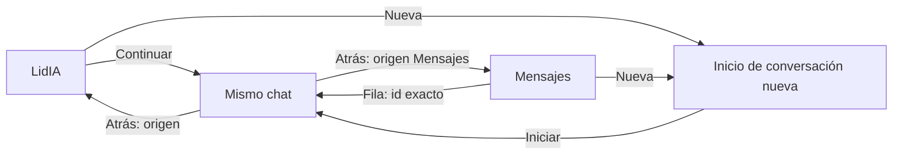
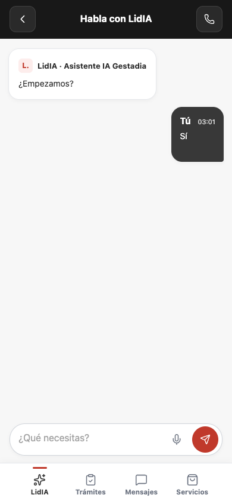
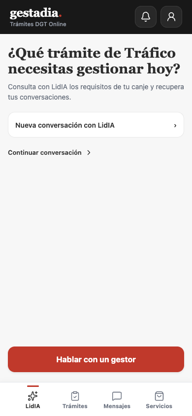
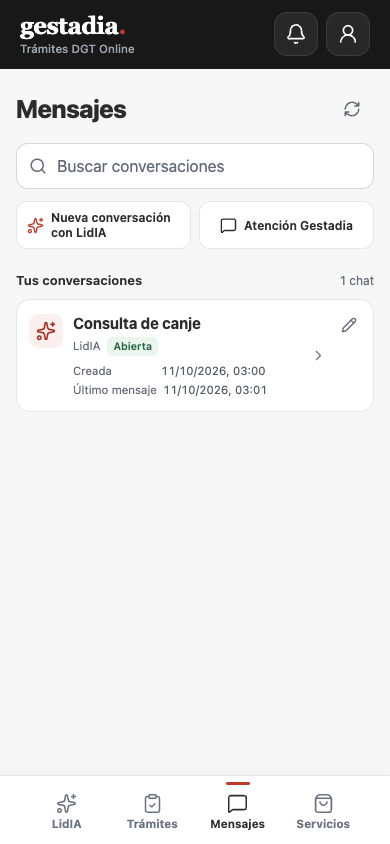

# LidIA: accesos fuera del chat

Corrección solicitada el 11/10/2026. Sustituye únicamente la decisión del [08/10](2026-10-08-nueva-conversacion-lidia.md) de ofrecer otra conversación sobre el compositor. Ese documento y sus capturas conservan su carácter histórico.

## Decisión y recorrido

«Nueva conversación con LidIA» permanece en la pestaña LidIA y en Mensajes. Se retira del chat de LidIA, abierto, cerrado o con una operación pendiente. La conversación conserva cabecera, Atrás al origen, historial, recuperación de envíos y compositor cuando procede. Para empezar otra, se vuelve a Inicio o Mensajes.

«Continuar conversación» permanece en Inicio. El comentario humano sobre ese acceso llegó cortado; se pidió aclaración y no se infiere otra modificación.

| Pantalla / estado | Origen | Atrás | Acción final |
|---|---|---|---|
| LidIA `/` | Pestaña / regreso del chat | Principal | Nueva abre el inicio explícito; Continuar recupera el chat existente |
| Mensajes `/mensajes` | Pestaña / regreso del chat | Principal | Nueva abre el inicio explícito; fila abre su id exacto |
| Chat `/lidia/conversacion` | LidIA / Mensajes / acceso / enlace | Origen completo; LidIA si directo | Seguir en el mismo chat; no ofrece iniciar otro |
| Nueva `/lidia/conversacion?nueva=UUID` | LidIA / Mensajes / acceso | Origen completo; LidIA si directo | Sólo Iniciar crea una sesión independiente |

## Comprobación

- Se actualizaron las regresiones existentes: ausencia de la acción en chat abierto/cerrado/pendiente; borrador y envío incierto conservados; abrir una nueva desde fuera no reutiliza historial ni cursor. Inicio/Mensajes mantienen sus accesos e intención explícita.
- `NODE_OPTIONS=--no-experimental-webstorage npm test --prefix frontend`: **160/160**, 34 archivos. `npm run app:build`: correcto. `cap sync`: recursos copiados a iOS/Android; las rutas locales de dependencias generadas se descartaron del diff.
- Navegador a **390 × 844**, APP real servida desde el worktree en **5181**, API interceptada con una cuenta y mensajes ficticios. Inicio → Continuar → chat → Atrás → Inicio → Mensajes: control eliminado, compositor visible, accesos conservados y sin desbordamiento horizontal. Las capturas se tomaron al terminar el movimiento de pantalla. [Auditoría](evidencias/2026-10-11-lidia-accesos/auditoria.json).
- El fixture de navegador no envió mensajes ni creó sesiones remotas. No acredita integración con el agente, despliegue o instalación/ejecución nativa de esta revisión. No modifica permisos, API ni el flujo anónimo pendiente.

| Chat de LidIA | Pestaña LidIA | Mensajes |
|---|---|---|
|  |  |  |

[Mapa vivo](NAVEGACION.md) · [Manual](MANUAL-DESARROLLO.md) · [Inventario de diseño](PLAN-DISENO-APP.md).
