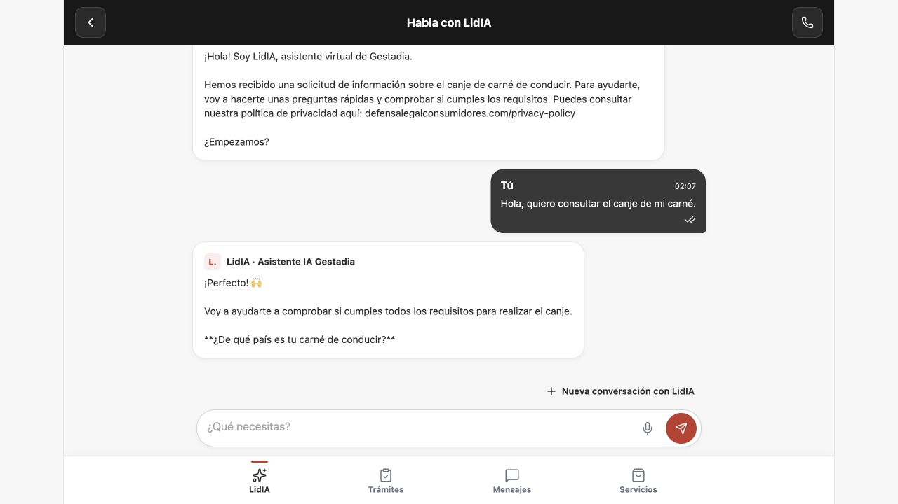

# Reanudar la prueba APP → Portal → LidIA119

[Manual de desarrollo](MANUAL-DESARROLLO.md) · [Navegación](NAVEGACION.md) · [Plan](../superpowers/plans/2026-10-11-app-integraciones-119-122.md) · [Coordinación](../integraciones/2026-10-10-coordinacion-portal-contrato-v2.md).

## Código y revisión

Rama aislada `codex/app-integraciones-119-122`, worktree `app-integraciones-119-122`, base `app/main`7eed2d6; correcciones guardadas y publicadas en0f30eca. PR12 contra app/main, adjunta al chat. La revisión independiente de7eed2d6..3af8ec2 encontró tres Important y ningún Critical/Minor. Se corrigieron en una pasada con pruebas que reprodujeron el fallo antes de cambiar producción:

| Hallazgo | Comprobación final |
|---|---|
| Candidato122 local activo, cerrado remotamente: se abría otra122 | Reevalúa destino119; caso inverso con creación nativa apagada abre122. La apertura explícita cerrada no crea otra. |
| Recorte de permisos dejaba referencias comercial/gestor | Referencias nulas al retirar su permiso; un recorte vacío produce retirada válida sin bloquear el worker. El grant guardado conserva sus datos originales. |
| Grant entre barrido y entrega preparaba contexto119 ampliado | La actualización usa configuración por integración, antes de guardar la operación. Carrera reproducida contra Prisma/servicios reales;119 queda sondeo/history y122 conserva el grant permitido. |

RED:5 fallos esperados y13 correctos; GREEN:18/18 pruebas de registro. Harness completo final: **201/201 backend,152/152 frontend, build APP correcto, exit0**, limpieza de base temporal ejecutada. Pruebas externas con fixture; no acreditan el proveedor119 ni el móvil. Evidencia local de ejecución: `/tmp/gestadia-119-122-review-red.log`, `-green.log` y `-final-suite.log`; estos logs pueden perderse al reiniciar, por eso el resultado y los casos se conservan aquí y los tests en Git.

No se han modificado pantallas, Atrás, campos o colores; las capturas anteriores mantienen su fecha/procedencia. El mapa recoge la resolución backend y su límite de aceptación.

## Entorno recuperado

- APP demo5174 y tablero5190 arrancados y HTTP200; preview8099 existente conservado. Configuración pública del repositorio: demo, conversaciones desactivadas.
- Claves S2S recuperadas mediante cápsula RSA-OAEP-SHA256/AES-GCM, sin rotación ni exposición en chat/log. Configuración privada en `/Users/gonchumon/.codex/private/gestadia-app/consumer-lidia.env`, modo0600, directorio0700, fuera de Git. Contiene únicamente los dos perfiles y once claves por capacidad;119 no tiene handoff.
- El payload recuperado coincide con119/102/PRO (`gestadia-app-pro-agent119-validation`) y122/103/PRO (`gestadia-app-pro-local-validation`), con audiencias distintas y key IDs globalmente únicos. Las claves no conceden por sí solas autoridad de cuenta.
- El equipo LidIA comunica PRO718, SHA84ef05902b87439dd92008ef73a8deaa2a5d7b99, backups previos, migración de recibos y configuración119 adicional/122 conservada. Portal localizó ese commit y observó HTTP200 en `/health` y `/`; esa observación pública no acredita SHA/configuración efectivos. Playground119 comunicado por LidIA es una prueba distinta del recorrido APP.

## Cuenta y base: recuperación histórica pendiente

La base Portal anterior era MySQL temporal/tmpfs y ya no existe. El SQL y tar de recuperación indicados por el acta del07/10 estaban en `/private/tmp`; no se localizaron tras reiniciar ni en worktrees, directorio privado, Descargas, Escritorio o Documentos. Los contenedores MariaDB/tmpfs detenidos pertenecen a LidIA; no se reinterpretan como la base Portal. No se ha arrancado ni sobrescrito una base ajena.

Se leyó la respuesta humana original del chat LidIA, turno `01a11574-f232-73a0-80b4-a293ca2ce538`: autoriza renovar24h **las autorizaciones existentes** de `cliente.local@example.test`, sólo en la base local, conservando permisos/asignaciones/historial. Esa instrucción no autoriza reconstruir una cuenta/grant desde metadatos históricos. No se ha renovado ni creado autoridad.

LidIA ha pedido al usuario decidir entre facilitar un respaldo para restaurar o autorizar una cuenta ficticia local nueva con sondeo/history durante24h, sinCRM/pagos/WhatsApp. La respuesta humana posterior del turno `01a12843-53c2-79b3-a1eb-96602b78e26f`, leída directamente, fue «Crear cuenta ficticia local y probar el119». Autoriza el fixture nuevo de24h, no reconstruir los chats de la cuenta perdida ni ampliar facultades. El principal nuevo no hereda chats ni prueba recuperación del historial perdido122.

## Procedimiento de recuperación y prueba

1. Revisar esta rama/ledger y la respuesta humana vigente. Conservar5174/5190/8099; asignar puertos separados a la prueba conectada.
2. Si aparece un backup: verificar procedencia/hash, restaurar sólo en una base local propia nueva y comprobar principal, grants, expedientes y asociaciones antes de renovar únicamente su vigencia autorizada. No apuntar las pruebas unitarias a esa base.
3. Si se autoriza una cuenta nueva: crear base local propia con almacenamiento durable y etiquetas de propietario, enlazada sólo a127.0.0.1. Aplicar migraciones Portal allí; crear sólo el principal y grant sondeo/history aprobados, sin expediente ni asignación. Mantener original122 intacto en LidIA.
4. Guardar manifest, configuración, credencial local y backup en directorio privado persistente0700/0600. Documentar rutas/comprobaciones; nunca sus secretos. Confirmar Stripe/Zoho/SMTP/LidIA legacy desactivados en el proceso de prueba, APP v1 habilitada y v2 apagado.
5. Arrancar backend desde el commit revisado; publicar sólo la configuración pública conectada de esa instancia local, sin cambiar el archivo demo versionado ni incluir claves S2S en el navegador.
6. Observar login → nueva consulta → apertura literal del119 → respuesta del usuario → respuesta literal en APP; correlacionar con timeline/agente119 en LidIA. Un200/recibo pendiente no confirma una respuesta del proveedor.
7. Con backup de la cuenta original, reabrir122 y comprobar que conservó su historial/reintentos. Con cuenta nueva, comprobar ambos ámbitos con chats nuevos autorizados, dejando expresamente pendiente recuperación histórica122; no presentar ese escenario como equivalente.
8. Registrar versión, flags, permisos/vigencia, conversación/operación, captura y resultado; actualizar manual/mapa si aparece un cambio visible. Native/emuladores/iPhone, CRM, agenda, correo y v2 se aceptan por separado.

## Parada y siguientes reinicios

Detener sólo PID/contenedor verificados del fixture propio, guardar dump y manifest privados y conservar el volumen durable. No usar `--rm`/tmpfs para el circuito que debe sobrevivir a reinicios. La suite canónica sí conserva su base descartable, guard y limpieza: `node scripts/test-app-conversations.mjs`. El preflight existente diagnostica el antiguo fixture reducido; no se considera listo para119/PRO por pasar sus trece tests unitarios.

La integración Git del código revisado en `app/main` cuenta con la autorización humana previa de commit/push/sync y la conformidad posterior LidIA. Se mantiene independiente de la puerta de cuenta y de la prueba conectada. El merge conserva configuración pública apagada y no crea/renueva autoridad.

## Cierre Git comprobado

PR12 fusionada en app/main mediante `be6bed66327e9efe521ecd380d549fcb07a307c2`; checkout principal actualizado ff-only, limpio y0/0 frente a origin. Backend/frontend/scripts son idénticos al snapshot0f30eca probado (201backend/152frontend/build); los cambios posteriores fueron documentales. Worktree conservado para la prueba conectada; v2 sigue separado. No se han creado ni renovado permisos ni cambiado la configuración pública por esta integración.

## Instancia conectada preparada — 11/10/2026

- APP **http://127.0.0.1:5177/#/acceso**, backend **http://127.0.0.1:3004**, ambos sólo loopback.5174 conserva demo: el texto «Explorar demostración» proviene de `demoOnly=true`, no de una versión antigua. El override público de5177 tiene `conversationsEnabled=true`, `demoEnabled=false` y `demoOnly=false`; no modifica el archivo demo versionado ni contiene claves.
- Código `e61504e2c05ca4ba7851b8ee2375aacc44d00f8d`. Wrapper privado importa `createApp` y el worker real del registro revisado. Stripe/Zoho/SMTP/LidIA legacy/v2 apagados; sondeo119 adicional activo,122 conservado.
- Base `gestadia_app_local119`, contenedor `gestadia-app-local119-a5c084d2`, volumen `gestadia-app-local119-data-a5c084d2`, owner `a5c084d2-1fa7-4e3c-8a8c-8f699284dde2`. Publicación MySQL sólo127.0.0.1, sin tmpfs ni eliminación automática. Siete migraciones aplicadas exclusivamente en esta base nueva.
- Principal ficticio `64a53aba-39a3-4559-93a1-cfb86ed0e09e`, grant `history/sondeo`, validado2026-10-11T00:06:08.018Z y válido hasta2026-10-12T00:06:08.018Z. Verificación de cuenta sintética local: no se envió correo ni se usaron datos reales. Un usuario, cero expedientes, cero conversaciones al preparar; referencias de expediente/comercial/gestor nulas.
- Directorio privado persistente `/Users/gonchumon/.codex/private/gestadia-app/fixture-local119/` modo0700. `manifest.json`, `credential.json`, `runtime.env`, scripts y SQL modo0600; secretos fuera de Git. `database-seed.sql` tiene22960bytes y hash registrado en manifest. No publicar ni copiar estos archivos a documentación.
- Preflight ejecutado: health200, login201, perfil200, listado vacío y sesión de preflight revocada. No se abrió una conversación ni hubo llamada LLM en ese chequeo. Son comprobaciones de preparación, no aceptación conversacional.
- LidIA recibe URL/rutas privadas/UUID/vigencia/SHA y reserva el primer turno desde UI para evitar duplicarlo. El ciclo UI y recuperación ya están comunicados por LidIA y las capturas se inspeccionaron; su atribución SQL/LlmCallLog también quedó comprobada en la evidencia fuente al cerrar el ciclo. El historial remoto122 anterior se conserva; su recuperación por la cuenta perdida no se prueba con este principal.

### Retomar esta instancia después de otro reinicio

1. Leer el manifest privado, comprobar etiquetas owner del contenedor/volumen y vigencia del grant. Si ha caducado, no ejecutar el seed ni renovar automáticamente; la autoridad24h no se amplía por reiniciar.
2. Con Docker Desktop disponible, arrancar **únicamente** el contenedor anterior si está detenido. Comprobar su puerto local con `docker port gestadia-app-local119-a5c084d2 3306/tcp` y comparar con manifest/runtime privado antes de continuar. No crear otra identidad o reasociar historial para recuperar procesos.
3. Si3004/5177 están libres y el código coincide con manifest, ejecutar en terminales separadas:

```sh
python3 /Users/gonchumon/.codex/private/gestadia-app/fixture-local119/runner.py backend
python3 /Users/gonchumon/.codex/private/gestadia-app/fixture-local119/runner.py frontend
```

Estos wrappers cargan sólo la configuración privada de la prueba y actualizan sus PID. No cargar `.env` de producción ni volver a ejecutar `seed`. Los scripts privados dependen de este equipo; un checkout nuevo requiere preparar su entorno bajo la autoridad correspondiente. Conservar SQL/manifest/volumen, y al detener verificar PID/comando/owner actuales.

## Recorrido observado en APP — 11/10/2026

LidIA efectuó login y una nueva conversación desde la UI de5177. Portal inspeccionó las capturas originales y consultó en sólo lectura su base local: conversación APP `bd407295-a152-4763-bb7b-a4764585af7c` enlaza con sesión remota `352cceb4-9c5f-4774-9291-549ae2fe90f5`, integración `gestadia-app-pro-agent119-validation`, estado activo y contexto1 sincronizado1. Hay una sola operación de turno, admitted200, turnId `ce76b66b-c0e8-448b-b4e7-74f0b6fead35`, operación Portal `2b12bd8b-fba8-46ae-a72a-f824cf1797ba` y remota `7f5498c8-cb32-4fde-b37c-d74ff959d856`.

La UI muestra el saludo original, el texto «Hola, quiero consultar el canje de mi carné.» y la respuesta que pregunta el país. Tras recargar mantiene el mismo chat y los tres mensajes; no se envió un segundo turno. Son capturas de navegador desktop1280×720, no aceptación nativa/emulador/iPhone. LidIA aportó la consulta SQL al modelo remoto; Portal inspeccionó el JSON seleccionado y su captura con exit0. [Procedencia y hashes](evidencia/2026-10-11-lidia119/manifest.json).




Backup privado posterior `database-postturn.sql`,28145bytes, SHA256 `e30fc571219c87fc42b6c22b1efd0cc72f4b63d9fbc280aaebe868fb94e4c3a5`, guardado en el directorio persistente del fixture con0600. Contiene sólo esta cuenta nueva y el ciclo local autorizado; no se copia a Git. Manifest y evidencia seleccionada registran permisos `history/sondeo`, vigencia y referencias nulas.

### Atribución real y límites de cierre

La [evidencia SQL seleccionada](evidencia/2026-10-11-lidia119/app119-model-proof.json) y [captura de consulta fuente](evidencia/2026-10-11-lidia119/app119-sql.jpg), aportadas por LidIA y copiadas sin modificar sus bytes, atribuyen la misma sesión a **Agent119 / Project102 / instrucción10115 / Channel2(APP)**, sin WhatsApp ni contacto asociado. Su único **LlmCallLog39316**,2026-10-11T00:07:18.811392UTC, registra Anthropic `claude-haiku-4-5-20251001`, Purpose`conversation`, Success=true. La captura muestra salida0. No se deduce éxito de un HttpStatus: el campo es null y el éxito lo registra el modelo.

Queda comprobado este recorrido de cuenta **login → nueva consulta → un mensaje → respuesta del119 real → recuperación del mismo chat**, en navegador local y con permisos acotados. No es un sondeo completo, flujo CRM/contacto, conversación con gestor, recuperación del historial122 perdido ni aceptación iOS/Android/iPhone. V2/anónimo sigue fuera de esta prueba; la conformidad de sus mapas no lo activa. La configuración pública de5174 y del repositorio permanece demo.
