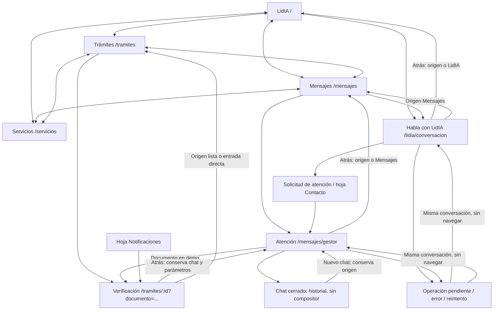
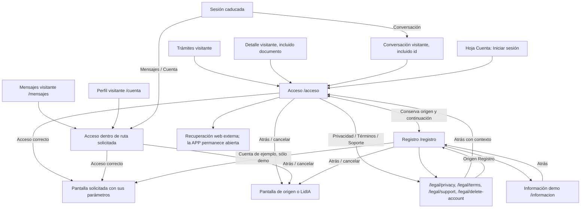
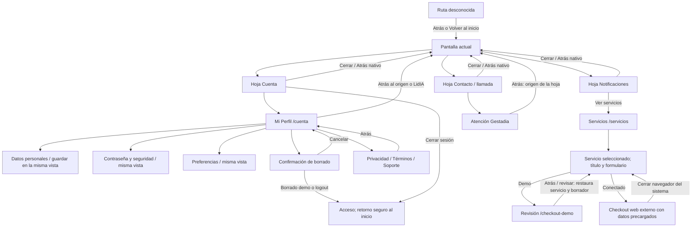

# Navegación de Gestadia APP

Auditoría del 07/10/2026. Alcance: rutas reales de `frontend/app/src/App.jsx`, modos visitante/demo/conectado, hojas y vistas de cuenta. Este mapa no valida permisos ni configuración de producción. [Glosario](../../GLOSARIO.md).

Regla: las cuatro pestañas son destinos principales y conservan el menú inferior. Una pantalla secundaria tiene Atrás al origen interno completo, o a su destino de reserva si se abre directamente. Acceso/registro y documentos legales pueden ocultar el menú, pero siempre permiten volver. Entrar no pierde la pantalla solicitada. Las hojas cierran sobre la pantalla que las abrió; navegar desde ellas guarda esa pantalla como origen, sin reabrir la hoja al volver.

## Pestañas, conversaciones y trámites

El chat conectado se identifica por `conversacion` y, cuando procede, `caso`. Esos parámetros forman parte del retorno; no se sustituye el chat seleccionado por uno nuevo. La validación real admite carga de documentos; el envío final guiado sólo existe en demo. Un error de carga permanece en la misma pantalla y conserva Atrás.

## Acceso, registro y sesión

El registro conectado explica el acceso compartido Portal/APP; no crea otra cuenta. Recuperación abre el navegador del sistema en nativo, o una pestaña separada en web. La demo permite explorar sin contraseña real. Ni cancelar ni Atrás efectúan logout o crean una conversación.

## Cuenta, hojas y servicios

En web el checkout abre una pestaña separada; en nativo abre el navegador del sistema, conservando la pantalla y el formulario en la APP. Los bloques de perfil y cambios de servicio son estados de su pantalla, no páginas nuevas. El borrado de cuenta y los permisos mantienen sus restricciones actuales. No se altera la contratación, la asignación CRM ni los mensajes por esta corrección.

## Inventario y decisión de retorno

| Pantalla / estado | Orígenes | Atrás; reserva para entrada directa | Menú inferior | Al completar |
|---|---|---|---|---|
| `/` LidIA | Pestañas / marca | No en inicio; la conversación demo vuelve a su origen o reinicia LidIA | Sí; no en acceso demo visitante | Abrir chat |
| `/tramites` | Pestañas | No: principal | Sí | Visitante abre acceso y retoma Trámites |
| `/mensajes` | Pestañas | Principal; acceso visitante sí tiene retorno | Sí salvo acceso visitante | Abre el chat exacto |
| `/servicios` | Pestañas / notificaciones | No: principal | Sí | Selección desplaza al título; checkout externo o demo |
| `/lidia/conversacion` | LidIA / Mensajes / acceso | Origen; `/` | Sí | Mismo chat y origen; no crear al volver |
| `/mensajes/gestor` | Mensajes / Contacto / validación | Origen; `/mensajes` | Sí | Cerrado mantiene historial; nuevo mantiene origen |
| `/tramites/:id` | Lista / notificación / documento del chat | Origen con query; `/tramites` | Sí | Demo continúa al gestor con retorno a validación |
| `/cuenta` | Hoja Cuenta / enlace directo | Origen; `/` | Sí autenticado; no visitante | Guarda sin navegar |
| `/acceso` | Trámites / chat / Cuenta / entrada directa | Origen; `/` | No | Pantalla solicitada y contexto; por defecto `/` |
| `/registro` | Acceso / entrada directa | Mismo origen del acceso; `/` | No | Demo continúa; conectado informa e invita al acceso |
| `/informacion` | Registro / directo | Origen; `/` | Sí | Regresar al registro |
| `/checkout-demo` | Servicios / directo | Origen con servicio y borrador; `/servicios` | Sí | Revisar o ir al inicio |
| `/legal/privacy` | Cuenta / Acceso / Registro | Origen completo; `/acceso` | No | Atrás restituye contexto |
| `/legal/terms` | Cuenta / Acceso / Registro | Origen completo; `/acceso` | No | Atrás restituye contexto |
| `/legal/delete-account` | Cuenta / navegación legal / directo | Origen completo; `/acceso` | No | Borrado demo con confirmación; real sin conectar |
| `/legal/support` | Cuenta / Acceso / Registro | Origen completo; `/acceso` | No | Enlaces externos sin perder la APP |
| Cuenta: datos, seguridad, preferencias | Dentro de Perfil | Cabecera del Perfil; bloques sin navegación | Como Perfil | Permanecer en vista |
| Borrado / renombrado / hojas | Perfil / Mensajes / cabecera / llamada | Cancelar o cerrar primero; devuelve foco al control de apertura | Pantalla de fondo | No usar historial hasta cerrar |
| Error / carga / sin permisos / chat cerrado | Ruta vigente | Conserva retorno de la ruta | Según ruta | Reintento no cambia origen |
| Ruta inexistente | Enlace / entrada directa | Origen válido; `/` | Sí | Volver al inicio |

## Hallazgos y comprobación

Antes del cambio: se reprodujo en navegador Trámites visitante → Entrar al portal → `/cuenta`, sin menú ni Atrás; acceso enviaba siempre a LidIA. El análisis de rutas confirmó retorno fijo del expediente al gestor y del chat IA al inicio, y pérdida del formulario al regresar del checkout demo.

Verificación de la corrección:

- **85 pruebas APP aprobadas en 11 archivos**, con `NODE_OPTIONS=--no-experimental-webstorage npx vitest run app/src`. Incluye 12 regresiones de navegación: cancelar/acceder desde Trámites, registro/legal/retorno, expediente y documento, chat exacto y caso, Perfil desde Servicios, LidIA desde Mensajes, checkout demo y borrador, acceso en Mensajes y entradas directas. Dos pruebas nativas acreditan la prioridad de la acción visible de retorno y la apertura externa web.
- **Navegador servido:** se reprodujo y comprobó Trámites → acceso → Atrás en `127.0.0.1:5175`; en `127.0.0.1:5176` se recorrió Trámites → acceso → registro → privacidad → términos → registro → acceso correcto → Trámites con la cuenta ficticia autorizada. También Servicios → hoja Cuenta → Perfil → Atrás → Servicios, y Mensajes → LidIA → Atrás → Mensajes. No se envió otro mensaje ni se abrió un chat remoto nuevo.
- **iOS real en simulador:** `com.gestadia.app`, Debug, iPhone 17 / iOS 26.5, build y arranque correctos. Trámites visitante → acceso → Atrás recupera Trámites y las cuatro pestañas. Trámites → Mensajes visitante → Atrás también recupera Trámites. La cabecera respeta la zona superior segura y los controles están visibles.
- **Android:** `assembleDebug` correcto (213 tareas), APK actualizado en `emulator-5560` mediante instalación con conservación de datos (`Success`); no se afirma ejecución del recorrido de interfaz. La aceptación global Android sigue pendiente de la autorización específica solicitada para el control del emulador. Sus pruebas unitarias no sustituyen esa ejecución.

[Acceso web con retorno a Trámites](evidencias/2026-10-07-navegacion/web-acceso-tramites.jpg) · [Atrás en acceso iOS](evidencias/2026-10-07-navegacion/ios-acceso-con-atras.jpg) · [Trámites y menú recuperados en iOS](evidencias/2026-10-07-navegacion/ios-retorno-tramites.jpg).

El checkout externo se verifica mediante prueba del destino y de la apertura separada, sin contratar ni pagar. El expediente desde notificaciones y la apertura del chat recién creado conservan el contexto por código; no se añade una afirmación de ejecución remota de esos recorridos. Las configuraciones públicas de compilación nativa siguen apuntando sólo al entorno local ya aprobado; la configuración versionada por defecto no se activa para producción.
