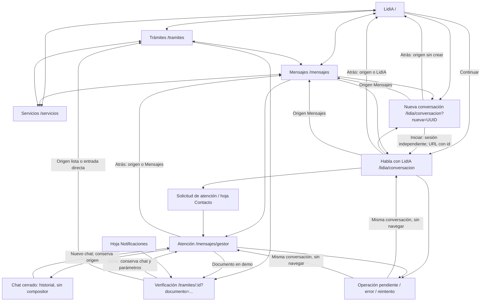
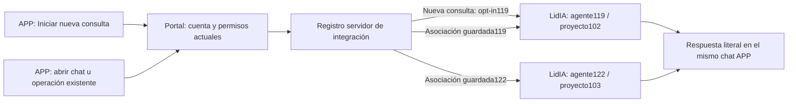
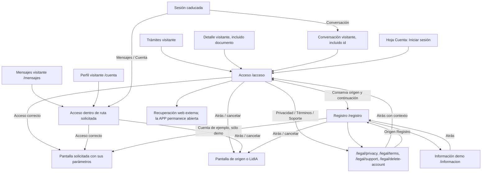
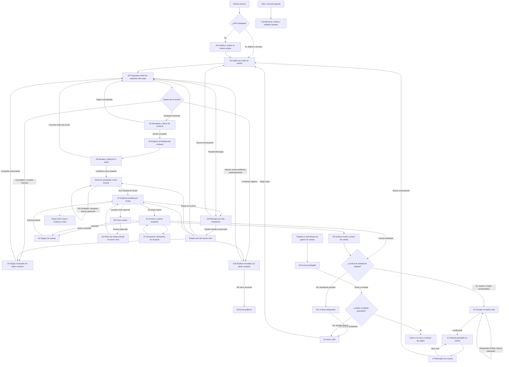
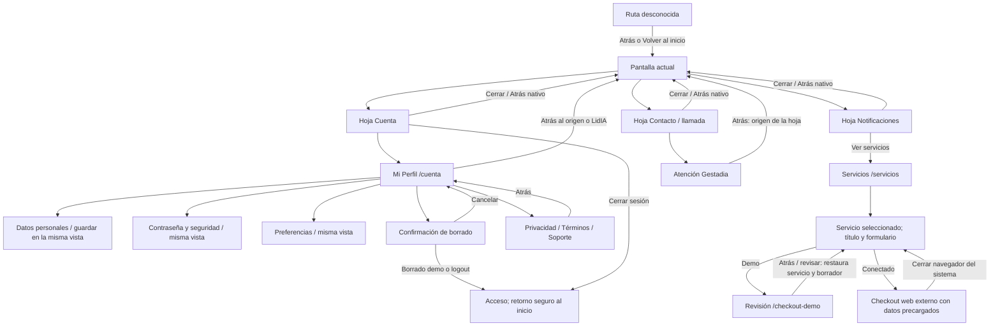

# Navegación de Gestadia APP

[Manual de desarrollo: cómo consultar y mantener este mapa](MANUAL-DESARROLLO.md).

[Coordinación técnica v2 del 10/10](../integraciones/2026-10-10-coordinacion-portal-contrato-v2.md): desarrollo del contrato autorizado en LidIA; consumidor Portal en preparación. Los mapas anónimos de abajo siguen siendo propuestas, sin nuevas rutas o permisos activados por esta entrega documental.

La precisión humana posterior fija que preguntas y decisiones pertenecen al agente 119. Los estados del diagrama representan lo que la APP muestra del agente; el cuestionario ilustrativo de la maqueta no define un motor de canje en Portal. Texto como respuesta base; contenido dinámico opcional. [Criterios vigentes del manual](MANUAL-DESARROLLO.md#criterios-que-debe-conservar-el-desarrollo).

Auditoría del 07/10/2026. Alcance: rutas reales de `frontend/app/src/App.jsx`, modos visitante/demo/conectado, hojas y vistas de cuenta. Este mapa no valida permisos ni configuración de producción. [Glosario](../../GLOSARIO.md).

Regla: las cuatro pestañas son destinos principales y conservan el menú inferior. Una pantalla secundaria tiene Atrás al origen interno completo, o a su destino de reserva si se abre directamente. Acceso/registro y documentos legales pueden ocultar el menú, pero siempre permiten volver. Entrar no pierde la pantalla solicitada. Las hojas cierran sobre la pantalla que las abrió; navegar desde ellas guarda esa pantalla como origen, sin reabrir la hoja al volver.

## Pestañas, conversaciones y trámites

Desde el 08/10/2026, Inicio distingue Nueva/Continuar y Mensajes ofrece Nueva; el chat abierto o cerrado conserva una acción compacta sobre el compositor. `nueva=UUID` conserva el intento de creación al recargar/reintentar; sólo Iniciar efectúa POST y conserva los chats anteriores. Una creación pendiente mantiene ese intento hasta confirmar su id. Al abrir un historial se indica «Cargando conversación…»; no se ofrece iniciar otra durante la recuperación. [Plan, conformidad y pruebas](2026-10-08-nueva-conversacion-lidia.md).

El chat conectado se identifica por `conversacion` y, cuando procede, `caso`. Esos parámetros forman parte del retorno; no se sustituye el chat seleccionado por uno nuevo. La validación real admite carga de documentos; el envío final guiado sólo existe en demo. Un error de carga permanece en la misma pantalla y conserva Atrás.

### Asociación backend preparada el 11/10/2026

Las pantallas, los parámetros y sus destinos de Atrás permanecen iguales. El servidor conserva la asociación de cada chat y reevaluará el destino de una consulta implícita si confirma que el candidato está cerrado. Nueva consulta119 exige configuración privada y autoridad vigente; atención e historial122 conservan su asociación. La APP no recibe un selector de agente. [Estado, pruebas y recuperación](2026-10-11-reanudacion-app-119.md).

Este diagrama explica la resolución preparada, no acredita activación ni una conversación remota. No añade pantallas ni habilita visitantes v2.

## Acceso, registro y sesión

El registro conectado explica el acceso compartido Portal/APP; no crea otra cuenta. Recuperación abre el navegador del sistema en nativo, o una pestaña separada en web. La demo permite explorar sin contraseña real. Ni cancelar ni Atrás efectúan logout o crean una conversación.

### LidIA sin cuenta: mapas actualizados el 10/10 (propuesta)

**Pendiente de aprobación e implementación.** El recorrido actual sigue autenticado. Esta revisión incorpora la corrección humana: **primero requisitos; contacto sólo tras resultado suficiente y voluntad de gestor; solicitud como visitante; cuenta opcional después para guardar el chat**. [Diagrama con capturas](2026-10-10-mapas-pantallas-app-anonima.md) · [Propuesta técnica](../integraciones/2026-10-10-propuesta-app-anonima-lidia.md) · [Contraste con LidIA](../integraciones/2026-10-10-contraste-portal-app-anonima.md).

Un deeplink abre el chat sin pasar por Inicio o acceso. APP cerrada/abierta resuelve una sola entrada. Sin APP instalada se indica instalar y **reabrir el mismo enlace**; no se presume que la tienda conserve el contexto.

| Pantalla / estado propuesto | Orígenes | Atrás / cancelar; reserva directa | Menú inferior | Al completar |
|---|---|---|---|---|
| 01 Inicio LidIA | Primera apertura / pestañas | Principal | Sí | Abrir canje o continuar chat propio |
| 02 Consulta / 03 Preguntas | Deeplink / Inicio / Mensajes | Origen; LidIA si directo | Sí | Misma sesión; sin pedir nombre ni contacto |
| 04 Resultado suficiente | Revisión completa del agente | Origen; conserva chat | Sí | Ofrecer gestor; no activar por país o human_review |
| 05 Contacto / 06 Datos | Resultado suficiente y voluntad expresa | Chat; cancelar antes del envío | Sí | Nombre y teléfono O email, propósito y confirmación como visitante |
| 07 Solicitud recibida | ACK durable de Portal | Chat / Mensajes | Sí | Cuenta opcional; solicitud no equivale a cita |
| 08 Registro / A1 Acceso | Oferta de guardar chat tras la solicitud | Mismo chat; solicitud intacta | No; Atrás visible | Verificar cuenta y control de instalación original |
| 09 Verificación de email | Registro opcional | Corregir email / registro | No; Atrás visible | No envía otra solicitud |
| 10 Vinculación pendiente | Cuenta verificada Y control de instalación original | Recuperar misma operación; conservar contexto | No; retorno visible | Misma sesión, actor histórico y solicitud |
| 11 Chat vinculado | Retorno del alta / Mensajes | Origen; LidIA si directo | Sí | Mismo historial recuperable en otros dispositivos |
| 12 Mensajes con cuenta / A8 visitante | Pestaña | Principal | Sí | Filas compactas; Nueva conversación aquí, sin botón flotante en chat |
| A2 Cancelación / A3 caducidad | Alta opcional | Chat original | Atrás visible | No cancela ni reenvía la solicitud recibida |
| A4 Revisión incompleta | Resultado parcial/revisión humana | Origen; conserva respuestas | Sí | Seguir sin pedir contacto comercial |
| A9 Solicitud pendiente | Datos confirmados, envío/ACK incierto | Origen; operación conservada | Sí | Comprobar la misma operación; «recibida» sólo tras ACK durable |
| A10 Resultado negativo | Resultado completo del agente | Origen / Servicios; nueva evidencia voluntaria | Sí | No repetir automáticamente ni abrir gate de contacto |
| A11 Vínculo bloqueado | Cuenta verificada sin control de instalación original | Inicio; no historial ajeno | No; Atrás visible | Recuperación separada por acordar; enlace/contacto no bastan |
| A7 Recuperación de contraseña | Acceso opcional | Acceso con continuación | Atrás visible | Recuperación externa sin perder chat |
| A6 Trámites / gestor directo | Pestaña / deeplink protegido | Acceso con retorno al origen | Según ruta | La solicitud de contacto no concede chat de gestor ni expedientes |
| Legales / soporte | Chat / acceso / registro / cuenta | Pantalla exacta que abrió el documento | No; Atrás visible | Volver sin consumir la continuación |

Las preguntas son estados del mismo chat. Atrás en su cabecera vuelve al origen; reabrir la fila recupera el estado alcanzado. Antes del envío se puede cancelar la intención; **cancelar el registro después no cancela la solicitud ya recibida**. La sesión identifica el recorrido y su pertenencia, sin acreditar una cuenta por coincidencia de teléfono/email.

La cuenta gratuita no habilita expedientes. Los flujos Zoho convierten lead a contacto/trato y envían Cerrado ganado al backend Gestadia. El tablero es una maqueta declarada, no una ejecución de LidIA, registro real, agenda o iOS/Android.

## Cuenta, hojas y servicios

En web el checkout abre una pestaña separada; en nativo abre el navegador del sistema, conservando la pantalla y el formulario en la APP. Los bloques de perfil y cambios de servicio son estados de su pantalla, no páginas nuevas. El borrado de cuenta y los permisos mantienen sus restricciones actuales. No se altera la contratación, la asignación CRM ni los mensajes por esta corrección.

## Inventario y decisión de retorno

| Pantalla / estado | Orígenes | Atrás; reserva para entrada directa | Menú inferior | Al completar |
|---|---|---|---|---|
| `/` LidIA | Pestañas / marca | No en inicio; la conversación demo vuelve a su origen o reinicia LidIA | Sí; no en acceso demo visitante | Abrir chat |
| `/tramites` | Pestañas | No: principal | Sí | Visitante abre acceso y retoma Trámites |
| `/mensajes` | Pestañas | Principal; acceso visitante sí tiene retorno | Sí salvo acceso visitante | Abre el chat exacto |
| `/servicios` | Pestañas / notificaciones | No: principal | Sí | Selección desplaza al título; checkout externo o demo |
| `/lidia/conversacion?nueva=UUID` | LidIA / Mensajes / chat / acceso | Mismo origen; `/` | Sí | Iniciar crea otra; URL canónica con id; no cierra la anterior |
| `/lidia/conversacion` | LidIA / Mensajes / acceso | Origen; `/` | Sí | Mismo chat y origen; no crear al volver |
| `/mensajes/gestor` | Mensajes / Contacto / validación | Origen; `/mensajes` | Sí | Cerrado mantiene historial; nuevo mantiene origen |
| `/tramites/:id` | Lista / notificación / documento del chat | Origen con query; `/tramites` | Sí | Demo continúa al gestor con retorno a validación |
| `/cuenta` | Hoja Cuenta / enlace directo | Origen; `/` | Sí autenticado; no visitante | Guarda sin navegar |
| `/acceso` | Trámites / chat / Cuenta / entrada directa | Origen; `/` | No | Pantalla solicitada y contexto; por defecto `/` |
| `/registro` | Acceso / entrada directa | Mismo origen del acceso; `/` | No | Demo continúa; conectado informa e invita al acceso |
| `/informacion` | Registro / directo | Origen; `/` | Sí | Regresar al registro |
| `/checkout-demo` | Servicios / directo | Origen con servicio y borrador; `/servicios` | Sí | Revisar o ir al inicio |
| `/legal/privacy` | Cuenta / Acceso / Registro | Origen completo; `/acceso` | No | Atrás restituye contexto |
| `/legal/terms` | Cuenta / Acceso / Registro | Origen completo; `/acceso` | No | Atrás restituye contexto |
| `/legal/delete-account` | Cuenta / navegación legal / directo | Origen completo; `/acceso` | No | Borrado demo con confirmación; real sin conectar |
| `/legal/support` | Cuenta / Acceso / Registro | Origen completo; `/acceso` | No | Enlaces externos sin perder la APP |
| Cuenta: datos, seguridad, preferencias | Dentro de Perfil | Cabecera del Perfil; bloques sin navegación | Como Perfil | Permanecer en vista |
| Borrado / renombrado / hojas | Perfil / Mensajes / cabecera / llamada | Cancelar o cerrar primero; devuelve foco al control de apertura | Pantalla de fondo | No usar historial hasta cerrar |
| Error / carga / sin permisos / chat cerrado | Ruta vigente | Conserva retorno de la ruta | Según ruta | Reintento no cambia origen |
| Ruta inexistente | Enlace / entrada directa | Origen válido; `/` | Sí | Volver al inicio |

## Hallazgos y comprobación

Antes del cambio: se reprodujo en navegador Trámites visitante → Entrar al portal → `/cuenta`, sin menú ni Atrás; acceso enviaba siempre a LidIA. El análisis de rutas confirmó retorno fijo del expediente al gestor y del chat IA al inicio, y pérdida del formulario al regresar del checkout demo.

Verificación de la corrección:

- **85 pruebas APP aprobadas en 11 archivos**, con `NODE_OPTIONS=--no-experimental-webstorage npx vitest run app/src`. Incluye 12 regresiones de navegación: cancelar/acceder desde Trámites, registro/legal/retorno, expediente y documento, chat exacto y caso, Perfil desde Servicios, LidIA desde Mensajes, checkout demo y borrador, acceso en Mensajes y entradas directas. Dos pruebas nativas acreditan la prioridad de la acción visible de retorno y la apertura externa web.
- **Navegador servido:** se reprodujo y comprobó Trámites → acceso → Atrás en `127.0.0.1:5175`; en `127.0.0.1:5176` se recorrió Trámites → acceso → registro → privacidad → términos → registro → acceso correcto → Trámites con la cuenta ficticia autorizada. También Servicios → hoja Cuenta → Perfil → Atrás → Servicios, y Mensajes → LidIA → Atrás → Mensajes. No se envió otro mensaje ni se abrió un chat remoto nuevo.
- **iOS real en simulador:** `com.gestadia.app`, Debug, iPhone 17 / iOS 26.5, build y arranque correctos. Trámites visitante → acceso → Atrás recupera Trámites y las cuatro pestañas. Trámites → Mensajes visitante → Atrás también recupera Trámites. La cabecera respeta la zona superior segura y los controles están visibles.
- **Android:** `assembleDebug` correcto (213 tareas), APK actualizado en `emulator-5560` mediante instalación con conservación de datos (`Success`); no se afirma ejecución del recorrido de interfaz. La aceptación global Android sigue pendiente de la autorización específica solicitada para el control del emulador. Sus pruebas unitarias no sustituyen esa ejecución.

[Acceso web con retorno a Trámites](evidencias/2026-10-07-navegacion/web-acceso-tramites.jpg) · [Atrás en acceso iOS](evidencias/2026-10-07-navegacion/ios-acceso-con-atras.jpg) · [Trámites y menú recuperados en iOS](evidencias/2026-10-07-navegacion/ios-retorno-tramites.jpg).

El checkout externo se verifica mediante prueba del destino y de la apertura separada, sin contratar ni pagar. El expediente desde notificaciones y la apertura del chat recién creado conservan el contexto por código; no se añade una afirmación de ejecución remota de esos recorridos. Las configuraciones públicas de compilación nativa siguen apuntando sólo al entorno local ya aprobado; la configuración versionada por defecto no se activa para producción.

### Presentación de Mensajes

El listado conectado utiliza filas compactas. Los accesos «Nueva conversación con LidIA» y «Atención Gestadia» mantienen el origen `/mensajes` y no crean sesiones al pulsarlos: Nueva muestra el inicio explícito de una sesión independiente; los chats del listado recuperan sus ids exactos. Esta pantalla muestra únicamente el dock inferior, sin el botón fijo de contacto duplicado. Renombrar se despliega en la fila seleccionada y devuelve el foco al lápiz al guardar o cancelar.

### Revisión común de pantallas

El [plan de diseño y matriz visual](PLAN-DISENO-APP.md) actualiza la suite conjunta a **88 pruebas APP aprobadas** y registra 64 inspecciones en cuatro anchuras, además de los retornos recorridos en el simulador iOS. Información y checkout demo mantienen Atrás y dock sin CTA de contacto duplicado. Mi Perfil conectado remite la recuperación al portal y no solicita contraseñas para una operación todavía pendiente. El recorrido de interfaz del APK Android de esta revisión sigue pendiente.
