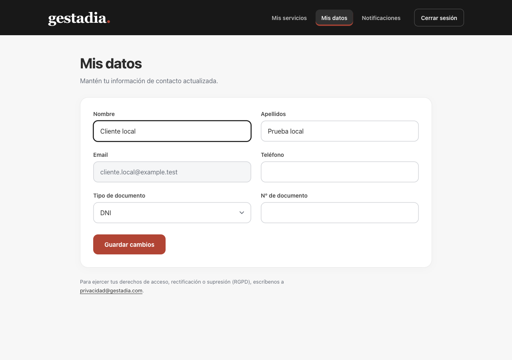

# Perfil Portal y comprobación integrada local — 07/10/2026

## Resultado visual

El formulario `Mis datos` tiene etiquetas encima de sus campos, alturas y espacios homogéneos, dos columnas en escritorio y una en móvil. El foco del campo se destaca en negro, el botón de guardar mantiene el rojo Gestadia y la cabecera negra presenta la navegación y el cierre de sesión con estilos visibles. No se modifica el envío ni el contenido de los datos personales.

La captura inicial tenía clases de CSS Modules sin resolver: el lanzador efímero usaba `configFile:false` y omitía `css.modules.localsConvention:"camelCaseOnly"`, aunque la configuración web versionada ya lo declara. Se corrigió el lanzador local para respetar esa opción únicamente en la web. También se mejoraron `PortalLayout.module.css` y `MisDatos.module.css`; no se cambió la configuración de módulos de la APP.

Verificación con navegador real a 390×844 y 1280×900: seis campos visibles, sin clases ausentes ni desbordamiento horizontal; las pestañas y el cierre de sesión quedan disponibles en ambos tamaños. Se comprobó también la navegación a `Mis servicios`. Foco negro del campo: RGB24,24,24. Contraste calculado: texto secundario 5,03:1, etiquetas 10,86:1 y blanco del botón sobre rojo 5,44:1. Compilación web `npm run build`: PASS.



## Recuperación de contextos antiguos

La prueba conectada mostraba dos operaciones de contexto `outcome_unknown`, de revisión4 y6, mientras las mismas conversaciones ya tenían revisiones5 y7 sincronizadas. LidIA responde explícitamente HTTP409 `stale_context`; el consumidor anterior seguía reintentando indefinidamente.

LidIA dio conformidad al siguiente límite semántico: únicamente una operación `context` con HTTP409 `stale_context` y una revisión superior sincronizada de la misma asociación puede quedar `superseded`. La revisión superior se relee bajo transacción de cuenta. El registro conserva el rechazo; no se afirma que la operación antigua fuese admitida. Fallos de transporte, otras respuestas HTTP, revocaciones y revisiones sin confirmar conservan su tratamiento anterior.

La regresión principal falló antes de la reparación: 121 pruebas, 120PASS y un fallo que esperaba `superseded` y obtenía `outcome_unknown`. Se corrigió `deliverLifecycle` y se añadieron límites negativos, incluido cambio de asociación y pérdida de confirmación durante la llamada. Se verifica también la conservación del request, respuesta, clave idempotente y fecha de retención.

El backend local propio se reinició con guardia de PID/ruta y puerto, conservando DB/CA/claves/permisos. Su worker normal procesó las dos operaciones a las 09:23:37UTC. Ambas quedan `superseded`, `errorCode:stale_context`, `httpStatus:409`; no se borró ni forzó ningún registro. La evidencia antes/después acredita hashes de petición, respuesta y clave idénticos, retención intacta, contextos5/5 y7/7 y grants sin cambios:

- [Antes](evidencia/2026-10-07/contexto-anterior.json).
- [Después](evidencia/2026-10-07/contexto-resuelto.json).

Lecturas HTTP reales posteriores: sondeo200/active, 10 mensajes y cinco recibos completed; gestor200/in_support, dos mensajes y un recibo completed. No se reenviaron turnos para esa comprobación. Durante el reinicio hubo una indisponibilidad transitoria de lectura; el equipo LidIA confirmó después la recuperación de la UI y el historial.

## Proyección vigente de opciones en la APP

Durante un turno nuevo de prueba, LidIA detectó que las acciones de una presentación anterior seguían habilitadas después de aparecer una nueva. La fuente confirmó que Timeline con cursor sólo entrega mensajes posteriores y que las invalidaciones de presentaciones anteriores se proyectan al releer esos mensajes.

La APP relee un snapshot autoritativo paginado al avanzar `state_revision` o ver un recibo completed/failed nuevo. Exige una revisión uniforme entre páginas, acumula los recibos de todas ellas y reemplaza el historial con los mensajes autorizados actuales. Así también desaparece un mensaje omitido por retirada de acceso. Un error de historial posterior a un envío admitido no convierte ese envío en incierto. No se reenvían turnos para refrescar y no se inventan flags enabled desde la caché.

Cinco regresiones reproducidas antes de corregir y verificadas después: presentación nueva paginada, acción consumida sin presentación nueva ni avance de revisión, revisión que cambia entre páginas, mensaje retirado y recibo terminal en primera página. Incluyen conservación de historia autorizada y limpieza del pendiente con el mismo turn_id.

## Verificación final del código

- `node scripts/test-app-conversations.mjs`: 122 pruebas backend PASS, sobre una base MySQL temporal propia que se elimina al finalizar; incluye siete regresiones nuevas de contexto.
- Suite frontend final: 103 pruebas PASS, incluidas 19 de AppConversation y las cinco regresiones anteriores.
- `node --test scripts/app-local-preflight.test.mjs`: 13PASS.
- Builds web y APP: PASS. APP final:80 módulos,760ms.
- `git diff --check`: PASS.

## Comprobación previa en lectura

`scripts/app-local-preflight.mjs` combina el estado Portal de la **cuenta primaria de prueba** con `app-local-runtime.py check` de LidIA. Exige cuenta activa/verificada, autoridad temporal con historial y asignaciones válidas, propiedad del expediente, contexto sincronizado, sesión de dispositivo, cola de contexto/revocación sin pendientes, backend local propio y verificaciones efectivas de configuración/DB/autoridad LidIA. No arranca procesos ni renueva permisos.

```sh
node scripts/app-local-preflight.mjs \
  --manifest /tmp/gestadia-app-local-e2e-20261006/portal-local.json \
  --lidia-checker /Users/gonchumon/.codex/worktrees/gestadia-app-conversacional/Gestadia_LidIA/scripts/app-local-runtime.py \
  --lidia-fixture /tmp/gestadia-app-local-20261006
```

El manifest y las claves siguen privados fuera del repositorio. El diagnóstico omite PII, credenciales, referencias privadas de asignación y cuerpos de las operaciones. Rechaza bases externas o fuera del namespace temporal. La evidencia de aislamiento Portal usa health efectivo para Stripe/Zoho/SMTP, más el PID propio y el último log de arranque para APP/legacy; no lo presenta como introspección viva de todos los flags.

[Resultado final](evidencia/2026-10-07/preflight-final.json), observado a 09:23:38UTC:

- `ready:true`, doce comprobaciones PASS y cola0.
- Sondeo5/5 y gestor7/7; siete sesiones de dispositivo vigentes.
- `permissions_renewed:false`; grants Portal hasta 08/10/2026 08:27:45UTC.
- Horizonte **conjunto** hasta 08/10/2026 00:00UTC (**02:00 Madrid**), limitado por las rutas LidIA. `ready_until` se publica únicamente si todos los controles pasan; un plazo Portal aislado no acredita el circuito.

La [comprobación de cierre](evidencia/2026-10-07/preflight-cierre.json), a 2026-10-07T09:39:59.065Z, vuelve a dar ready:true y cola0 después de los turnos de verificación coordinados.

El checker de LidIA contrasta config cargada, ensamblado, TLS servido, MariaDB y autoridad efectiva; el runtime usado en esta lectura corresponde al binario reportado por el equipo LidIA como source848812428, SHA256 `f5626a226fae9a118c76d90f9c940ba62c6536515263d79cedca3c2a70d4c5b3`. Rutas interpretadas en UTC sin ampliar su vencimiento.

## Alcance

Evidencia de una integración local con cuentas y operadores ficticios, bases temporales y modelo determinista identificado. No acredita agente119, Zoho real, modelo real, identidad corporativa de operadores, despliegue ni activación. Los servicios quedan disponibles en loopback: Portal5173, APP5174, backend3001 y LidIA7443. Trabajo aislado en PR9; no se modifica `app/main` ni se fusiona/despliega.

[Glosario](../../GLOSARIO.md). Los informes históricos del 05 y06/10 conservan su alcance y fecha.
