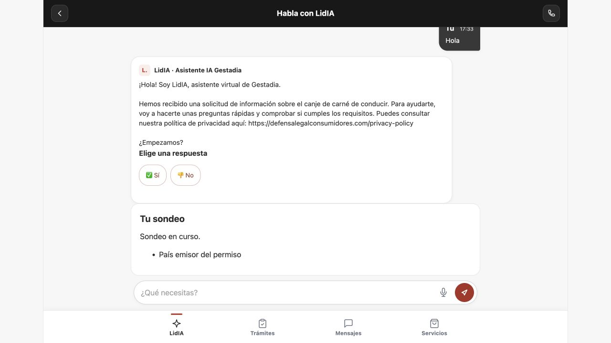

# Prueba del canal APP con instrucciones originales del 119 — 07/10/2026

Resultado: un texto/respuesta desde APP local 5176 alcanzó el agente APP dedicado 122 y el modelo real Anthropic, con contenido/version de instrucciones copiados literalmente del 119. La prueba solicitada del canal queda cerrada; no se añaden funciones ni refinamientos.

[Documento vigente](../app/INTEGRACION-LIDIA.md) · [Glosario](../../GLOSARIO.md) · [Acta fuente LidIA](/Users/gonchumon/.codex/worktrees/gestadia-app-conversacional/Gestadia_LidIA/docs/integraciones/2026-10-07-conexion-app-agente-119-real.md)

## Alcance y recorrido

El humano autorizó S2S para ambos equipos y corrigió el alcance a comprobar primero un clon con instrucciones originales. Portal conserva su rama `codex/app-conversaciones-backend` / PR 9 sin fusionar ni desplegar Portal. LidIA es responsable del agente, runtime PRO, claves y registro del modelo; Portal de cuenta/grant/backend/UI y recibos.

Backend 3003/APP 5176 con base nueva `gestadia_app_literal_test`. Misma identidad exacta del principal, misma integración/audiencia `gestadia-app-pro-local-validation`, permisos `sondeo`/`history` hasta 08/10/2026 14:53:47 UTC (16:53:47 Europe/Madrid), sin expediente/asignaciones CRM. No se creó un sujeto nuevo en LidIA ni se alteró el historial anterior 5175. La validación de cuenta es un fixture; no acredita correo de invitación real entregado. Secretos fuera de Git, frontend sin claves S2S, TLS normal y Stripe/Zoho/SMTP/legacyLidIA apagados.

UI: iniciar sesión → abrir conversación con LidIA → abrir conversación → enviar exactamente «Hola» una vez → esperar respuesta. No se pulsaron opciones ni se enviaron más textos. La respuesta se dejó abierta también en el navegador del humano, recuperando el mismo chat sin turnos adicionales.

## Evidencia correlacionada

| Dato | Resultado |
|---|---|
| Conversación Portal | `5cc1b4dc-0dff-4439-b575-e343cc710a5d` |
| Conversación LidIA/ChatSession | `a0490f84-6eba-4c0c-a02a-579d1aa72b11` |
| Agente/proyecto/instrucción/canal | 122/103/10116/2 APP |
| Contenido/version instrucción | Igual a 10115 del 119, `1.8-mario-adaptado` |
| SHA256 instrucción | `ec616c2687189eaded1a77d904d2c720aa12c8ab9f629850f74bc4202bcd0286` |
| SESSION / CONTEXT / TURN | 201/200/200, todos admitidos |
| Operación turno Portal | `afc32c4b-f140-40ff-a0ba-6f31e442c704` |
| Estado/contexto | 4 / contexto 1, sincronizado 1 |
| Registro LLM fuente | 38464, 07/10/2026 15:33:52.287280 UTC |
| Proveedor/modelo efectivo | Anthropic / `claude-haiku-4-5-20251001` |
| Resultado y propósito | Success 1 / `app_conversation` |
| Timeline fuente | Un «Hola» cliente + una respuesta asistente |

[Estado Portal](evidencia/2026-10-07/app-clon-literal-estado-portal.json), [registro SQL/modelo sanitizado exacto](evidencia/2026-10-07/literal-channel-model-evidence.json), [igualdad instrucción y diferencias operativas](evidencia/2026-10-07/clon-literal-instruccion.json), [habilitación S2S histórica](evidencia/2026-10-07/s2s-effective-evidence.json).

## Límites y conservación

El agente 122 conserva IDs/propiedad propios y aislamiento operativo; timeout, automatización y conexión WhatsApp difieren del 119. El runner sigue componiendo instrucción más política APP y exige `emit_app_turn`. No se acredita equivalencia completa de runtime, herramientas o automatismos WhatsApp. Original 119 intacto según la comparación de LidIA.

El audit Anthropic almacena sólo metadata, no prompt completo. La igualdad de instrucción procede de BBDD y la composición del runner del código servido V1.708; los campos de comparación de prompt del extracto son null. No se infiere igualdad textual del prompt efectivo desde ese audit.

Los tres turnos anteriores 5175 usaban la adenda inicial; sus incidencias de país tipado/input de opción se conservaron sin refinar ni reescribir historia. Playground y fixture determinista son comprobaciones anteriores distintas. Este único saludo no acredita sondeo completo, atención comercial/gestor, eventos Zoho, pago, instalación física ni despliegue Portal.

La creación adicional de segundo sujeto para revocación fue rechazada por revisión automática y no se ejecutó ni se reintentó. No se declara revocación real PRO. Se mantienen consumidor/autoridad del principal en el plazo aprobado; las claves HMAC v1 requieren retirada o apagado explícitos y no caducan automáticamente por `validUntil`.

## Verificación de esta entrega

Lectura fresca de recibos locales: una cuenta, una conversación y tres operaciones admitidas; concordancia del ID remoto con el extracto SQL, un turno/una llamada LLM, Success 1 y captura revisada sin secretos. Sólo documentación/evidencias cambian en esta fase; no se repiten suites de producto ya registradas ni se ejecutan turnos adicionales.
