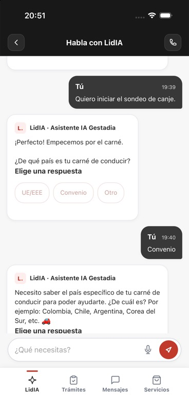

# Validación nativa de Mensajes — 07/10/2026

Estado: bloque APP implementado y ciclo de atención de cuenta observado en iOS. Android compila y está instalado; su recorrido de interfaz sigue pendiente. La app completa todavía no se da por válida. [Contrato y reparto](2026-10-07-mensajes-y-ciclo-gestor.md) · [Glosario](../../GLOSARIO.md).

## Implementación y verificaciones automáticas

Portal d204de1 incorpora nombres por cuenta/conversación, búsqueda de nombre/interlocutor, fechas de creación y último mensaje, metadatos vigentes y estado abierto/cerrado. Permite otra sesión tras cierre sin reabrir ni sustituir la histórica. Se retiró «Tu sondeo». Las acciones mantienen identidad y revisión; el texto visible persistido procede de la etiqueta validada por LidIA.

El bloque posterior impide mostrar Mensajes de demostración al entrar como visitante en una app conectada, oculta la petición de atención repetida cuando ya está solicitada/asignada/en atención y ajusta la altura de la aplicación y el teclado nativo. Usa @capacitor/keyboard 8.0.6 con resize native, sin desactivar el desplazamiento del WebView. El último paquete mantiene la cabecera y permite desplazar el perfil.

- Backend APP: 72 pruebas aprobadas en la base aislada de prueba, antes de este bloque exclusivamente frontend/nativo.
- Frontend APP: 71 pruebas aprobadas en 10 archivos tras el ajuste final, mediante `NODE_OPTIONS=--no-experimental-webstorage npx vitest run app/src` con la configuración jsdom del proyecto.
- iOS: build_run_sim aprobado, bundle com.gestadia.app, Debug, iPhone 17, iOS 26.5, simulador 96BE5D86-6CD4-4AF4-96B2-1B402FF181D3.
- Android: assembleDebug aprobado, APK instalado con Success en emulator-5560, AVD LIA_Codex_Pixel_8_API_36 en modo read-only. Instalar acredita el paquete, no su funcionamiento.

## Atención real desde iOS

Mismo principal autorizado 1cf42992-e1cd-4d3b-b723-f4ad5e301f39, datos ficticios. Ruta APP support, departamento 5 «Gestadia APP - prueba de atención», operador existente integraciones@vozenter.com. case_ref NULL; sin expediente CRM inventado. Este recorrido acredita atención de cuenta, no asignación de gestor a un expediente real.

Conversación local 6ca9e097-e102-4f4f-9eb5-efb9bbfdb86f, remota a589bb52-60b3-4196-941d-fb52f78b8829. Se solicitó atención y LidIA confirmó asignación. Se vio en iOS la respuesta escrita desde la bandeja real: «IOS-20261007: soy el operador de integraciones y te atiendo.» (20:07 Europe/Madrid). Se respondió una vez «Ios» desde el teclado nativo (20:13); LidIA confirmó recepción y dos mensajes persistidos, sin llamadas LLM en atención.

Tras detener/reabrir la aplicación y volver a iniciar sesión se recuperaron ambos mensajes y la misma conversación. El acceso actual usa sessionStorage: esta prueba confirma recuperación después de re-login, no sesión de acceso persistente al reiniciar. Se renombró a «Atencion iOS» y se filtró con «atencion» desde la interfaz nativa; el nombre se conservó al recuperar y la última actividad no cambió por renombrar.

LidIA cerró una vez desde la bandeja real. En iOS se observó Cerrada, creación 07/10/2026 20:05 y último mensaje 20:13. El historial conserva ambos mensajes, no muestra compositor ni envío y ofrece Nueva conversación. Desde ese flujo se abrió otra: local 2bf9f2c0-b7c3-4f9a-b9fa-138986b5dfa5, remota 6e22c36b-ca2a-490f-95c4-ad3f914376a4, creada 2026-10-07T18:47:09.798Z. Lectura de la DB local confirmó nueva active sin mensajes y anterior closed con nombre/historia conservados. La nueva se dejó sin handoff para la prueba Android pendiente.

[Listado con nombre, fechas y cierre](evidencias/2026-10-07-ios/ios-mensajes-cerrada.jpg) · [Historial cerrado sin envío](evidencias/2026-10-07-ios/ios-historial-cerrado.jpg).

## Turno IA y etiqueta visible

Sesión remota a0490f84-6eba-4c0c-a02a-579d1aa72b11, local 5cc1b4dc-0dff-4439-b575-e343cc710a5d. La opción «Convenio» fue pulsada en web tras la publicación de LidIA, persistió como texto y se recuperó en iOS tras re-login. Se observó la burbuja «Tú / 19:40 / Convenio», sin UUID. No se reescribieron mensajes anteriores ni se envió de nuevo esa acción.

Desde iOS se envió una sola vez «IOS-20261007: Colombia» (20:29) y se observó la respuesta «¡Perfecto, Colombia! …» con las opciones siguientes. LidIA acreditó secuencias 7/8, operación 2559c7d7-b96b-4b4f-91eb-8d7ef38b1e72 completed y LlmCallLog 38508, UTC 18:29:03, Anthropic / claude-haiku-4-5-20251001 / agente 122 / proyecto 103 / app_conversation / Success1. El agente 122 es el clon dedicado de 119; el saludo previo «Hola» y la configuración/instrucción literal se mantienen como pruebas independientes. Las acciones caducadas permanecen deshabilitadas.

La publicación de LidIA V1.709-app-opciones-y-fechas y las comprobaciones de proveedor/operador son evidencia comunicada por el equipo LidIA; Portal comprobó las respuestas en la interfaz nativa y sus asociaciones locales. No se atribuye este resultado al modelo determinista local.

## Navegación y teclado

Se observaron cabecera «Habla con LidIA», botones atrás/llamar y compositor con teclado abierto. Pulsar atrás con el teclado visible regresó a LidIA y lo cerró. El perfil se desplazó por gesto nativo hasta los campos inferiores y Seguridad, manteniendo cabecera/navegación. El primer intento de desactivar scroll del WebView bloqueaba estos gestos; se descartó y la evidencia adjunta procede del paquete corregido.

También se observaron el aviso amarillo temporal del micrófono, selección de Canje en Servicios con autoscroll y datos ficticios precargados, apertura Cuenta → Mi Perfil y ausencia de CTA de gestor en Perfil. No se pulsó checkout ni se guardaron cambios reales de perfil.

[Teclado y cabecera](evidencias/2026-10-07-ios/ios-teclado-cabecera.jpg) · [Perfil desplazado](evidencias/2026-10-07-ios/ios-perfil-scroll.jpg).

## Paquete y límites

Origen público de prueba http://localhost:5176, backend local 3003, DB gestadia_app_literal_test. Las credenciales S2S permanecen sólo en backend. La configuración empaquetada contiene flags públicos de prueba; la configuración versionada por defecto conserva demoOnly y no se activa una release de tienda.

| Artefacto | SHA-256 |
|---|---|
| JS index-eBNgjB-v.js, mismo en iOS/Android | 82d63488a44a0adddaed3e3af25d33a984a47120eb31c08e835dabe026d371a4 |
| CSS index-BRX9ER5Z.css | a65fc03aef6763d434e413a7396e183f204b4fa1dc39650609af950167f18a3e |
| APK debug Android | 93fa29279ba59597270d7b3e3de02780369bc9bb805e89bdc4c90f565754d42f |

Pendientes: ciclo completo y turno IA en Android, recuperación nativa tras interrupción de red y aceptación integral de funcionalidades conectadas. El control de interfaz disponible no reconoce el emulador Android; se solicitó autorización humana específica para ADB UI y no se ejecutará sin su respuesta. No hay prueba de pagos, conversión Zoho/Cerrado ganado, expediente real, borrado de cuenta ni publicación/instalación de esta versión en un dispositivo físico. Playground de agente APP requiere una adaptación específica y tampoco se declara validado.
