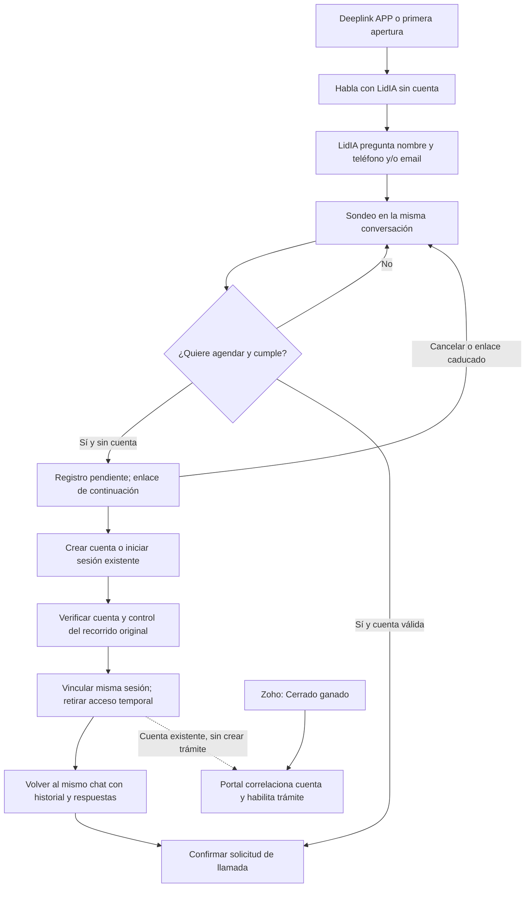

# Propuesta: LidIA sin cuenta, exclusivamente APP

**Fecha:** 10/10/2026. **Estado:** propuesta Portal para revisión conjunta; no implementada ni desplegada. [Glosario](../../GLOSARIO.md).

## Requisito recibido y resultado esperado

El usuario pide entrar directamente a hablar con LidIA desde un deeplink, o tras descargar la APP, sin registro previo. LidIA recoge nombre y teléfono y/o email durante la conversación, como en el recorrido anterior. Si cumple y quiere agendar una llamada, se ofrece un enlace con token para registrarse y vincular **esa misma sesión** a su cuenta. Quien ya tenga cuenta puede iniciar sesión en el mismo recorrido.

«Anónimo» significa **sin cuenta**; el sondeo sí puede contener datos de contacto declarados. Esos datos no prueban que el visitante sea titular de una cuenta existente. Registrar el acceso gratuito tampoco convierte al usuario en cliente con trámites habilitados.

Alcance: canal/integración APP de LidIA y backend/consumidor Gestadia APP. No abre el chat Web o WhatsApp, el portal privado ni conversaciones de gestor a visitantes. El evento Zoho Cerrado ganado conserva su responsabilidad y su tratamiento independiente.

## Comprobación del código actual

Base revisada: `app/main` en `a6d6e1497e32efa3c6a45fff3d6c67017a86bc05`.

| Punto | Evidencia | Consecuencia |
|---|---|---|
| Autenticación APP | `backend/src/app/identity.js`: login y authenticate exigen `accountProof(user)` | El modo conectado actual requiere una cuenta verificada. |
| Propiedad y operaciones | `backend/prisma/schema.prisma`: AppConversation y AppOperation están ligadas a User; `store.js`: ownedConversation comprueba userId | No basta omitir login en React ni hacer userId opcional sin revisar autorización e idempotencia. |
| Inicio S2S | `backend/src/app/conversations.js`: start envía portal_user_id e identity de cuenta | Hace falta una adenda explícita para la identidad previa al registro. |
| Registro conectado | `frontend/app/src/Register.jsx` remite a invitación/acceso; `backend/src/routes/auth.js` sólo login, set-password y recuperación | Hay que añadir alta gratuita y prueba de control de cuenta. El formulario demo no es un registro real. |
| Entrada nativa | `frontend/app/src/native.js`: navegación Atrás/enlaces externos, sin appUrlOpen/getLaunchUrl | Hay que implementar tanto el arranque desde enlace como la apertura con la APP ya activa. |

La viabilidad en Portal requiere esas ampliaciones. La equivalencia del recorrido del agente, la agenda y la transición remota requieren revisión de LidIA; no se infieren de las pruebas conectadas anteriores.

## Alternativas

| Alternativa | Coste y efecto | Valoración |
|---|---|---|
| Sujeto previo al registro APP separado de User, vinculado después | Amplía identidad y contrato S2S; mantiene el sondeo anterior al alta y acota permisos | **Recomendada.** Cumple el requisito y permite conservar la misma sesión. |
| Crear un User provisional por cada visitante | Contamina cuentas e invitaciones y obliga a distinguir muchas cuentas no verificadas; no debe simular prueba de cuenta | Descartada como atajo. |
| Exigir registro para iniciar conversación | Reutiliza el contrato actual | No cumple el requisito de hablar sin cuenta. |

## Recorrido propuesto

La agenda permanece pendiente hasta que Portal y LidIA confirmen la vinculación. Registrar la cuenta **no ejecuta automáticamente** una llamada o reserva: al volver se retoma la intención y se confirma una única solicitud con la operación correspondiente. Cancelar, recargar o volver atrás no crea otro chat.

LidIA debe conservar el resultado de cualificación y los datos declarados en su estado estructurado; no reconstruirlos leyendo texto generado. El usuario puede corregirlos. No se añadirá un formulario previo obligatorio que cambie el orden del agente sin acordarlo.

## Identidad, permisos y continuidad

1. Portal crea una identidad aleatoria previa a cuenta y una credencial revocable de instalación/sesión; conserva únicamente la huella del secreto. Tiene acceso a sus propios sondeos APP, envío, historial público y recibos, según la adenda. No admite case_ref, permisos de expediente, atención humana ni selección de agente/proyecto/entorno/CRM desde el móvil. El dato de contacto es al menos teléfono o email; nombre, formatos y límites se validan sin convertirlos en identidad autenticada. Antes de comenzar se informa del uso de esos datos y se mantienen accesibles privacidad y soporte.
2. La referencia de identidad conversacional debe permanecer estable durante el registro. Se añade la cuenta verificada a su asociación; no se copian mensajes ni se inicia otra ChatSession. Permanecen id público, ids de mensajes, revisiones, títulos, recibos y claves/resultados históricos de operación.
3. Las operaciones posteriores a la vinculación se autentican con la sesión APP de cuenta. Las antiguas mantienen su huella y sujeto original: una misma petición reintentada no adquiere otra identidad ni ejecuta dos efectos por cambiar de principal.
4. La lista de Mensajes muestra los chats accesibles al visitante de esa instalación, sin exponer historiales de otros visitantes. Después del registro, la cuenta recupera el chat vinculado también en otros dispositivos autenticados.
5. Se documentarán duración de credencial temporal, retención de datos/contactos y borrado. Propuesta inicial para revisión: credencial de visitante de hasta 7 días sin renovación ilimitada; enlace de continuación de 30 minutos; caducidad calculada y aplicada por servidor. Una credencial de corta duración no decide por sí sola la retención del historial. El backend debe limitar creación de identidades/chats, envíos y coste por sujeto e integración; no se permite sortear el límite obteniendo identidades sin control. Los secretos no aparecen en logs ni analítica; la página de continuación evita referer a terceros y elimina el token visible al resolverlo.

## Enlace de registro y vinculación comprobada

- Portal genera un token opaco aleatorio de al menos 256 bits, ligado a una conversación, integración, finalidad y vencimiento; guarda su hash. La respuesta sólo da una URL bajo el dominio HTTPS de Gestadia permitido por configuración del servidor.
- El deeplink público de entrada lleva únicamente contexto de recorrido permitido. No contiene nombre, teléfono, email, credenciales, ids CRM ni una referencia que permita abrir el chat de otra persona.
- Abrir una URL mediante GET no consume el token ni vincula nada: evita efectos de previsualizadores y escáneres de correo. El consumo exige acción autenticada después de verificar la cuenta.
- La continuación queda además vinculada al control de la instalación original. En el recorrido principal, registro web/nativo completa la prueba de cuenta y la APP original confirma la vinculación con su credencial previa. La credencial de cuenta no viaja en la URL de retorno. Una copia del enlace por sí sola no permite apropiarse del historial.
- Si se quiere completar desde otro dispositivo, hará falta una prueba adicional acordada: confirmación desde la instalación original o verificación del contacto previamente asociado. No se admite vincular sólo por coincidir el teléfono/email escrito en el chat. La recuperación con teléfono solamente requiere una solución de verificación de teléfono que hoy no existe en este contrato.
- Para esta primera ampliación se propone conservar el mecanismo de cuenta Portal por email. Quien haya conversado dando sólo teléfono puede seguir el sondeo y aportar un email al registrarse. Esto no impone email al comenzar el chat ni presupone una implementación SMS.
- Cuenta existente: acceso normal o recuperación, sin sobrescribir contraseña, crear duplicados ni mostrar si un email ya tiene cuenta en respuestas públicas. Verificar email del formulario no equivale a unificar historiales de personas por coincidencia.

## Consistencia Portal–LidIA

La vinculación será una operación durable e idempotente con transición explícita: preparada → confirmada por LidIA → acceso de cuenta confirmado. Portal persiste antes del envío S2S y recupera respuesta perdida consultando/reintentando la **misma operación**. El orden transaccional concreto y los DTO se cerrarán con LidIA antes de implementar.

Durante la transición se congela el envío temporal de la conversación afectada para evitar carreras; el historial se conserva y la UI muestra «Estamos vinculando tu conversación». Si falla el transporte, se mantiene recuperable y no se permite agendar, conceder ambos accesos ni crear una segunda sesión. Al confirmar, se consume el enlace y se retira todo acceso temporal a esa conversación. El reintento idéntico devuelve el mismo resultado; otro destino o una cuenta diferente se rechaza. Desactivar una cuenta no permite recuperar su chat reactivando el antiguo acceso anónimo.

Si el usuario mantiene varios sondeos previos, la operación cubre inicialmente sólo la conversación indicada en el enlace. Cualquier ampliación para agruparlos debe tener un ámbito explícito; el token no reclama todos los chats automáticamente. La autorización temporal debe retirarse por conversación sin dejar accesible la vinculada ni inutilizar silenciosamente las restantes; se cerrará con LidIA si esto requiere sujetos independientes por sondeo o un vínculo de identidad con permisos por conversación. Hasta resolver ese alcance no se implementará una revocación global del visitante. El cambio de cuenta en una instalación tampoco comparte sus credenciales temporales con el siguiente usuario.

## Reparto y cuestiones para LidIA

| Responsable | Entrega propuesta |
|---|---|
| Portal | Identidad previa a cuenta, API acotada, limitación de abuso/coste, alta gratuita y verificación, tokens de continuación, pertenencia, operación durable de vinculación y revocación. Conserva cuenta/credenciales compartidas APP–Portal. |
| APP | Entrar sin login a LidIA, deeplinks verificados y retorno, Mensajes limitado al visitante, registro/acceso con continuación, aviso de transición/caducidad y misma conversación al terminar. |
| LidIA | Aceptar identidad previa al registro sólo en APP, permisos/correlación diferenciados, captura estructurada, suspensión de agenda, contrato de vinculación idempotente y conservación del estado/historial/recibos. |
| Zoho | Sus propios POST de hechos CRM hacia Portal; no cambia el productor ni concede acceso por los datos autodeclarados del chat. |

Solicitado a LidIA el 10/10/2026 en el chat «Gestadia_LidIA - Actualizar rama dev/IA/main»: viabilidad real, punto de agenda, contrato de identidad/vinculación, revocación, límites APP y reparto. Pendiente su respuesta escrita y contraste de DTO/estados. No existe todavía conformidad conjunta para esta adenda.

## Deeplinks y navegación nativa

Usar enlaces HTTPS verificados: Universal Links de iOS y App Links de Android, con dominios y rutas permitidos por servidor. La APP resuelve la entrada una sola vez tanto en arranque frío como cuando recibe el enlace estando abierta; no ejecuta un turno o crea chats por duplicarse ambos eventos.

Sin aplicación instalada, la página de entrada ofrece instalar y volver a abrir el enlace. No se promete que el paso por la tienda conserve automáticamente el contexto: la primera entrega propone una continuación explícita tras la instalación. La página de entrada no habilita una conversación anónima en el canal Web.

El registro abre su formulario con Atrás al chat original; cancelar conserva el sondeo. Los enlaces directos tienen reserva de retorno a LidIA. Agenda, permisos de Trámites y conversación de gestor conservan sus propias comprobaciones. [Mapa actual](../app/NAVEGACION.md); este recorrido se añadirá como propuesta separada hasta validarlo en dispositivos.

Fuentes técnicas primarias consultadas: [Capacitor App: appUrlOpen/getLaunchUrl](https://capacitorjs.com/docs/apis/app), [Universal Links de Apple](https://developer.apple.com/documentation/xcode/allowing-apps-and-websites-to-link-to-your-content), [dominios asociados iOS](https://developer.apple.com/documentation/xcode/supporting-associated-domains) y [Android App Links](https://developer.android.com/training/app-links/about). Sustentan los mecanismos de apertura; la política de continuación tras instalar es una decisión de esta propuesta.

## Criterios de aceptación antes de activar

1. APP recién instalada y sin cuenta: conversación real, nombre + teléfono **o** email, respuestas y recibos; ningún login exigido al empezar.
2. Deeplink con APP cerrada/abierta y sin instalar: recorrido correcto, un solo inicio, retorno seguro y contexto permitido; enlace manipulado no selecciona otro sujeto/agente.
3. Registro nuevo y acceso existente: misma conversación, estado del sondeo y mensajes; visible después en otro dispositivo de la misma cuenta. Cuenta/contacto ajenos no pueden reclamarla.
4. Enlace caducado, cancelación, doble consumo, dos cuentas concurrentes y respuesta S2S perdida: sin doble vinculación, duplicado de chat ni reserva. Previsualización GET sin efectos.
5. Credencial temporal anterior rechazada después de vincular; cuenta revocada no permite reentrada anónima al chat vinculado. Recibos no retroceden.
6. Intentos anónimos de acceder a gestor, expedientes o Web/WhatsApp rechazados; registro no habilita trámites sin la autoridad comercial correspondiente.
7. Pruebas unitarias/API con base temporal, contrato compartido, ciclo conectado Portal–LidIA y recorridos reales en emuladores iOS/Android. Build o mocks por sí solos no cierran la aceptación.

## Estado de trabajo y despliegue

Preparación aislada en `codex/app-anonimo-lidia`, desde el app/main indicado. Sólo documentación: no migraciones, cambio de permisos, registro real ni canales activados. El despliegue Portainer/Plesk ya solicitado sigue pendiente; esta propuesta debe reflejarse en su alcance y compatibilidad, sin presentar la versión actual como compatible con conversaciones anónimas.

Antes de escribir código se cerrarán con LidIA el contrato y las responsabilidades y se presentará el diseño escrito para revisión, seguido del plan de implementación. Esta propuesta no sustituye la conformidad técnica de la fuente ni el resultado de una prueba real.
